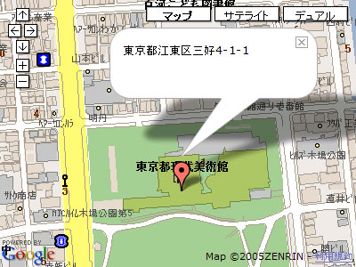

# Mapperプラグイン

エントリーなどに含まれる「mapタグ」をGoogle MapsやAlps Mapsなどのマッピングサービスを利用した地図画像に変換するプラグイン。

「mapタグ」とは、[Alps Clip!](http://www.alpslab.jp/clip.html)や[はてなマップ](http://map.hatena.ne.jp/help)で使用されている「[map:''address'']」という形式の文字列を指します。''address''には、「東京都江東区三好4-1-1」のような「住所」での表記を記述できるほか、「x139.808004y35.679714」「35.679714,139.808004」のような「座標」での表記も記述できます。

## 更新履歴

 * 0.01(2006.03.05):
   * 公開。
 * 0.02(2006.03.06):
   * !PublishCharsetがutf-8以外のときも正常に動作するように修正しました。また、MTMapperコンテナにcharsetオプションを追加し、明示的にcharsetを指定できるようにしました。
   * !DefaultLanguageがjaの時にはgeocoderとしてmaps.google.co.jpを、それ以外の時はmaps.google.comを見に行くようにしました。また、MTMapperコンテナにlanguageオプションを追加し、明示的にlanguageを指定できるようにしました。
   * Alps Clip!・はてなマップライクなmapタグの他に、[adr - Microformats](http://microformats.org/wiki/adr)風のデータ(&lt;div class="adr"&gt;''address''&lt;/div&gt;)でも地図描画されるように拡張しました。正確にはpost-office-box, extended-address, street-addressなどのadrのプロパティーには対応していません。日本語の住所に適用するのが難しいためです。
   * 他にも細かい修正。
 * 0.03(2006.03.08):
   * !PublishCharsetがUTF-8以外で、ブラウザがIE7 beta2, Sleipnirなどの場合にJavascriptエラーが発生する問題への対策。
 * 0.10(2006.03.13):
   * 座標でのmapタグ表記を許すように拡張しました。例)「map:x139.808004y35.679714」「map:35.679714,139.808004」
   * 負の経度・緯度に対応しました。西半球や南半球の地点の描画が行えるようになりました。
   * 細かいバグ修正。
 * 0.11(2006.03.18):
   * 「map:''address'' (''annotation'')」のように住所表記の後にアノテーションを加えられるようにしました。このアノテーションは住所検索時に無視されますが、Google Mapsによる地図描画時にはそのまま!InfoWindowに表示されます。
 * 0.12(2006.09.26):
   * Google Maps API version 2に対応した。
   * window.addEventListenerやwindow.attachEventを使うように修正した。
 * 0.12a(2006.09.27):
   * ページアンロード時にGUnloadが呼ばれるように小修正。

## 概要

このプラグインは、MTMapperというコンテナタグを実現します。このコンテナタグに含まれるテンプレート中で以下のパターンにマッチする文字列があれば、それをGoogle Mapsなどのマッピングサービスを利用した地図画像に変換します。

Alps Clip!・はてなマップライク:

    
[map:address]

    
[map:address]

adr microformatライク:

    
address

    
address

例えば、以下のようなmapタグを記述しておくと、

    
[map:東京都江東区三好4-1-1]

    
東京都江東区三好4-1-1

以下のようなGoogle Mapsによる地図描画用のコードを含んだページが生成されます。

    
    
    

    

このコードは以下のようなGoogle Mapsによる地図を描画します。

Alps Clip!・はてなマップライクのmapタグを利用する場合に&lt;p&gt;…&lt;/p&gt;、&lt;div&gt;…&lt;/div&gt;で囲まれていることを必須にしたのは、意図しない変換、例えばMTEntryTrackbackDataに対する変換、を抑制するためです。ちなみにMovable Typeの「改行を変換する」機能を利用している場合には、以下のように本文とmapタグの間に空行を置けば、自動的に&lt;p&gt;…&lt;/p&gt;で囲まれたmapタグを生成することができます。

    本文。
    
    [map:address]
    
    本文続き。

## 使い方

まず、Google Maps API Keyを未取得の場合には取得しておく必要があります。下記URLを参照してください。

 * [Google Maps API](http://www.google.com/apis/maps/)

Mapperプラグインをインストールするには、Mapper.zipに含まれるMapper.plをMovable Typeのpluginsディレクトリにコピーしてください。

次に各ブログの「プラグインの設定」画面を開き、Mapperプラグインの「設定を表示」をクリックします。すると、Google Maps API Keyを設定する画面が表示されますから、API Keyを入力して「変更を保存」をクリックして保存しておきます。

以上でインストールと設定は終了です。

次にテンプレートを編集して、変換対象とするテンプレート片をMTMapperコンテナで囲みます。下記はメイン・インデックスの変更例です。

    <MTMapper>
      <MTEntries>
      <$MTEntryTrackbackData$>
      
      <MTDateHeader><h2 class="date-header"><$MTEntryDate format="%x"$></h2></MTDateHeader>
      (snip)
      </MTEntries>
    </MTMapper>

以下は、個別エントリーアーカイブの場合。

    <MTMapper>
      

        <$MTEntryBody$>
      

      

        <$MTEntryMore$>
      

    </MTMapper>

以降は、前述の通り、エントリー中に以下のようなパターンでmapタグが記述されていれば、自動的に地図画像へと変換します。

Alps Clip!・はてなマップライク:

    
[map:address]

    
[map:address]

Alps Clip!・はてなマップライク(改行設定が「改行を変換する」になっている場合):

    本文。
    
    [map:address]
    
    本文続き。

adr microformatライク:

    
address

    
address

''address''には「東京都江東区三好4-1-1」のような「住所」表記のほか、「x139.808004y35.679714」「35.679714,139.808004」のような「座標」表記も記述できます。座標は「x経度y緯度」もしくは「緯度,経度」のようにペアで指定します。住所表記で正確な場所をポイントできない場合などには座標表記を使うとよいでしょう。

## 追加されるMTタグ

### MTMapperコンテナタグ

MTMapperコンテナタグは、以下のオプションで動作を制御できます。

 * method="Google|Alps": どのマッピングサービスを使ってマップを描画するかを選択します。デフォルトはGoogleです。

以下のオプションは、method="Google"の場合(methodオプションが未指定の場合も含む)のみ有効です。

 * width="size": 描画する地図の横幅を指定します。デフォルトは400px。
 * height="size": 描画する地図の縦幅を指定します。デフォルトは300px。
 * zoom="zoom-level": 描画する地図のズームレベルを指定します。デフォルトは15。0以上の整数を指定できますが、地域によってはGoogle Mapsが描画できないズームレベルもあります。
 * maptype="G_NORMAL_MAP|G_SATELLITE_MAP|G_HYBRID_MAP": 描画する地図のタイプを指定します。デフォルトはG_NORMAL_MAP。

## TODO

 * 座標情報をキャッシュして二度目以降の再構築を高速化する。
 * Google Maps, Alps Clip!以外のサービスに対応する。
 * 住所情報の記述方法をもう少し検討する。これに関しては下の議論を参照。

## General Issues

### 「住所情報」の記述方法について

「住所情報」の記述の容易性と厳密性のトレードオフという「いつもの問題」があります。

Alps Clip!のmapタグはstrictnessというか、検出の確実性・厳密性に多少欠けます。MTEntryTrackbackData中に含まれるデータにもマッチしてしまうのは典型例ですが、ユーザが明示的に住所情報にアノテーションを加えたデータのみを「住所情報」として扱うことが本質的に求められる性質で、Alps Clip!の方法は容易性の側に偏り過ぎています。

厳密さのためにはMicroformatを定義したり、エントリーのキーワードなどを利用したりする方が望ましいです(&lt;address&gt;…&lt;/address&gt;を使うのは違う気がしますし)。すでに定義されたMicroformatがあればそれを利用することも考慮したいと考えています。

実際に提案されているもの([adr - Microformats](http://microformats.org/wiki/adr))を見ると、こんなんで良いみたいなのですが、本当?

    
東京都江東区三好4-1-1

### Geocoding by Google Maps

method="Google"の場合、Google Mapsをgeocoderとして利用しています。

 * [Ogawa::Buzz: Google Mapsがgeocoderとして使えてしまう件について](http://blog.as-is.net/2005/11/google-maps-geocoder.html)

これが一種のscrapingなのではないかという指摘は…甘んじて受けます。

→ 最近はGoogle Maps APIでもGeocoderを提供しているのでもう少し楽にできるかもしれませんね。

## See Also

## License

This code is released under the Artistic License. The terms of the Artistic License are described at [http://www.perl.com/language/misc/Artistic.html]().

## Author & Copyright

Copyright 2006, Hirotaka Ogawa (hirotaka.ogawa at gmail.com)
